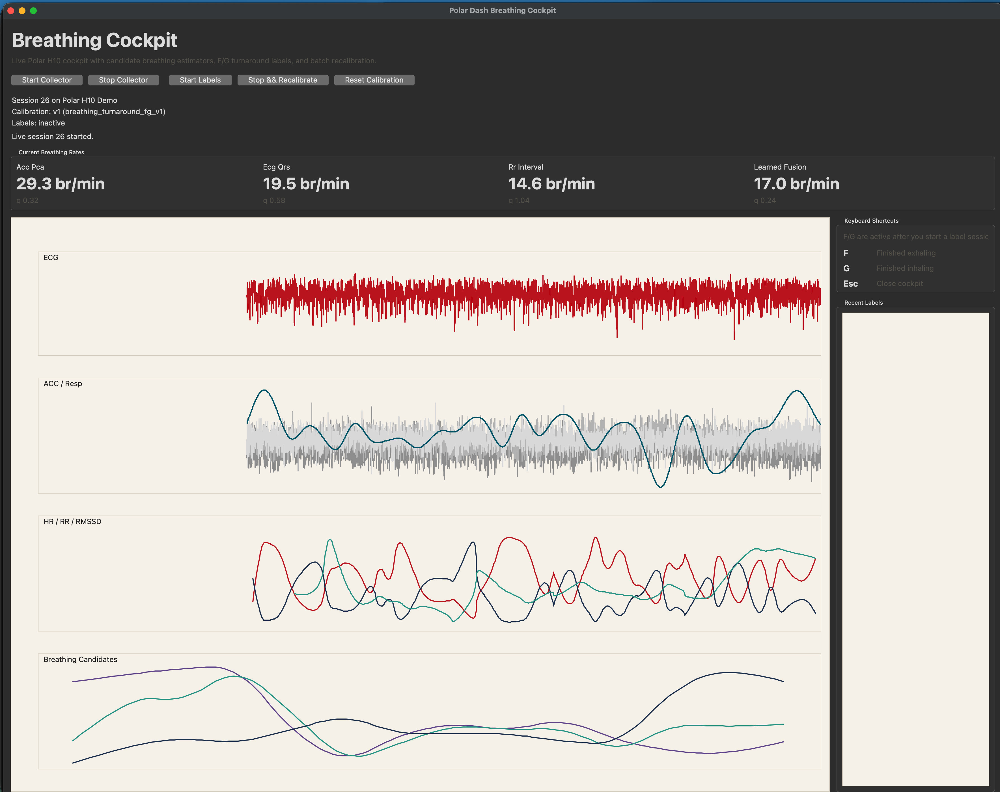

# Code Rating
- vibe slop
- brittle
- working

# Polar Dash

Polar Dash is a fast personal prototype for turning a Polar H10 chest strap into a lightweight macOS breathing and heart-rate monitor.

I built it to get a reasonable live approximation of:

- breathing rate,
- heart rate,
- short-window HRV (RMSSD),

visible on my MacBook without needing a full training or lab setup.

It is a practical hack, not a medical device. The breathing signal is inferred from ECG, RR intervals, and chest motion, so it is useful for feedback and experimentation, not diagnosis.


The menu bar companion keeps the latest breathing rate, heart rate, and HRV visible at a glance.



The Python cockpit remains available for labeling and recalibration work, but the normal live runtime now lives directly in the Swift menu bar app.

## Why This Exists

Most consumer heart-rate tools are good at heart rate and rough HRV, but not at making breathing visible in a way that is always in front of you while you work.

This repo is the result of a short build focused on that exact gap:

- collect live Polar H10 BLE data,
- keep a breathing/HR/HRV monitor with historical trend graphs always visible,
- estimate breathing from multiple imperfect signals,
- surface the result in a menu bar readout while keeping the Python cockpit around for optional calibration and offline analysis work.

## What's In The Repo

- `src/polar_dash/collector.py`: older Python collector path plus offline backfill helpers.
- `src/polar_dash/breathing.py`: reference Python ACC, ECG, RR, and fusion-based breathing estimation for tooling/calibration.
- `src/polar_dash/cockpit.py`: native Tk cockpit for visualization, labeling, and recalibration sessions.
- `src/polar_dash/dashboard.py`: Streamlit dashboard for inspecting persisted sessions.
- `src/polar_dash/labeler_v2.py`: keyboard-driven breathing-phase labeling workflow.
- `src/polar_dash/evaluate.py`: scoring utilities for estimates versus saved labels.
- `macos/BreathingBar`: Swift runtime app that owns BLE collection, live estimation, bundled calibration loading, derived graph-history storage, and the menu bar UI.

## Quick Start

Requirements:

- macOS
- Swift toolchain / Xcode command line tools

Launch the Swift runtime app:

```bash
./scripts/deploy-breathingbar-app.sh
```

The deploy helper rebuilds BreathingBar, replaces `/Applications/BreathingBar.app`, signs it, and launches the installed copy. The app scans for the Polar H10, connects directly over Bluetooth, loads the bundled calibration, stores only derived breathing/heart-rate/HRV points for the in-app history graph, and updates the menu bar without persisting raw sensor frames.

If you want the optional Python tooling for calibration, evaluation, or older inspection views:

```bash
uv sync
uv run polar-dash scan --timeout 4
uv run polar-dash cockpit --db data/polar_dash.db
```

If you prefer the older browser-based view:

```bash
uv run polar-dash dashboard --port 8501
```

Then open `http://127.0.0.1:8501`.

## Useful Commands

```bash
swift build --package-path macos/BreathingBar
./scripts/deploy-breathingbar-app.sh
./scripts/install-hr-stack.sh
hron
hroff
uv run polar-dash scan --prefix "Polar H10"
uv run polar-dash cockpit --db data/polar_dash.db
uv run polar-dash annotate-breathing --db data/polar_dash.db
uv run polar-dash evaluate-breathing --db data/polar_dash.db
uv run polar-dash dashboard --db data/polar_dash.db --port 8501
```

The `install-hr-stack.sh` helper installs `hron` and `hroff`. `hron` rebuilds, installs, signs, and launches `/Applications/BreathingBar.app`; `hroff` stops the installed app and also cleans up any legacy `swift run` process.

## Keyboard Shortcuts

The Python cockpit shows the shortcuts in the sidebar, and the label keys are active once you start a label session:

- `F`: mark "finished exhaling"
- `G`: mark "finished inhaling"
- `Esc`: close the cockpit

## How Breathing Is Estimated

The live estimator does not measure respiration directly. It builds a plausible rate estimate by combining:

- chest accelerometer motion,
- ECG-derived respiration features,
- RR-interval rhythm information,
- a learned fusion step with simple calibration support.

Research notes and the reasoning behind that approach live in [docs/breathing-rate-research.md](docs/breathing-rate-research.md).

## Repo Hygiene

This repository is intentionally prepared for public upload:

- local databases are ignored,
- runtime logs and scratch captures are ignored,
- no device IDs or machine-specific absolute paths are referenced in tracked files,
- the committed screenshots are sanitized demo assets rather than committed live databases.

Ignored local-only paths include `data/`, `tmp/`, and `.hr_stack/`.

## Verification

```bash
uv run python -m py_compile src/polar_dash/*.py
swift build --package-path macos/BreathingBar
```

## Limitations

- Breathing rate is approximate and sensitive to movement, strap placement, and signal quality.
- The menu bar app is macOS-only.
- The optional Python cockpit is intentionally utilitarian; this was built to be useful quickly, not polished into a product.
